# RAION MOTORS
## Electric Vehicle Configurator Platform

A complete vehicle configuration system built with Java Spring Boot. Customers design their vehicle online with real-time pricing updates, financing calculations, and instant order processing. The platform handles everything from initial selection through final purchase.

---

## VEHICLE LINEUP

| Model | Type | Starting Price | Power | Range | 0-60 |
|-------|------|----------------|-------|-------|------|
| **Level 1** | Compact Sedan | $45,000 | 290-360 hp | 400 mi | 4.0-5.0s |
| **Level 2** | Full-Size SUV | $85,000 | 670 hp | 450 mi | 6.0s |
| **Level 3** | Performance Sedan | $125,000 | 1,527-1,600 hp | 350 mi | 1.8-2.0s |
| **Level 4** | Ultra-Luxury SUV | $185,000 | 1,180 hp | 620 mi | 3.2s |

## SIGNATURE COLLECTION

Pre-configured vehicles designed by our engineers. Each signature package includes carefully selected features at a reduced total price.

**URBAN COMMUTER**  
Level 1 Premium with Enhanced Autopilot — $58,000 (Save $500)

**TRAIL TITAN**  
Level 2 Off-Road with Premium Maintenance — $98,500 (Save $1,000)

**TRACK BEAST**  
Level 3 Ultra with Track Package — $145,000 (Save $2,000)

**EXECUTIVE**  
Level 4 Flagship with Luxury Upgrades — $195,000 (Save $2,000)

---

## TECHNOLOGY

**Backend**
- Java 17
- Spring Boot 3.2.0
- Maven 3.6+
- RESTful API Architecture

**Frontend**
- HTML5 / CSS3
- Vanilla JavaScript (ES6+)
- Responsive Design

---

## PROJECT STRUCTURE

```
raion-ev-configurator/
├── src/main/java/com/raion/
│   ├── models/
│   │   ├── Vehicle.java (Abstract Base)
│   │   ├── Level1.java → Level4.java
│   │   ├── signatures/
│   │   │   ├── UrbanCommuterSignature.java
│   │   │   ├── TrailTitanSignature.java
│   │   │   ├── TrackBeastSignature.java
│   │   │   └── ExecutiveSignature.java
│   │   ├── Feature.java (Interface)
│   │   ├── Option.java
│   │   ├── ServicePackage.java
│   │   ├── Accessory.java
│   │   └── Order.java
│   ├── controllers/
│   │   ├── VehicleController.java
│   │   ├── SignatureController.java
│   │   └── OrderController.java
│   ├── services/
│   │   ├── PriceCalculator.java
│   │   ├── ReceiptGenerator.java
│   │   ├── EnvironmentalCalculator.java
│   │   └── ImagePathResolver.java
│   └── RaionConfiguratorApplication.java
├── frontend/
│   ├── index.html
│   ├── styles.css
│   ├── script.js
│   └── images/
└── receipts/ (Generated)
```

---

## GETTING STARTED

### Prerequisites

You need Java 17 or higher, Maven 3.6 or higher, and a modern web browser.

### Starting the Backend

```bash
# Clone repository
git clone https://github.com/yourusername/raion-ev-configurator.git
cd raion-ev-configurator

# Build and run
mvn clean install
mvn spring-boot:run
```

The server starts at http://localhost:8080

### Starting the Frontend

```bash
# Navigate to frontend
cd frontend

# Using Python
python -m http.server 5500

# Or using Node.js
npx http-server -p 5500

# Or VS Code Live Server
# Right-click index.html → "Open with Live Server"
```

Access the application at http://localhost:5500

---

## API DOCUMENTATION

### Base URL
```
http://localhost:8080/api
```

### Endpoints

#### Vehicles
```http
GET  /vehicles           # List all models
GET  /vehicles/{level}   # Get model details (level: 1-4)
```

#### Signatures
```http
GET  /signatures              # List all signatures
GET  /signatures/{name}       # Get signature details
```

#### Orders
```http
POST /order                   # Place custom order
POST /order/signature         # Place signature order
```

### Example: Place Custom Order

```json
POST /api/order
Content-Type: application/json

{
  "level": 2,
  "trim": "Premium",
  "color": "silver",
  "options": ["enhanced-autopilot"],
  "servicePackages": [],
  "accessories": ["floor-mats", "home-charger"]
}
```

---

## ARCHITECTURE

### Object-Oriented Design

**Inheritance Hierarchy**
```
Vehicle (Abstract)
├── Level1 → UrbanCommuterSignature
├── Level2 → TrailTitanSignature
├── Level3 → TrackBeastSignature
└── Level4 → ExecutiveSignature
```

**Polymorphism via Feature Interface**
```java
List<Feature> features = new ArrayList<>();
features.add(Option.createEnhancedAutopilot());
features.add(ServicePackage.createExtendedWarranty8Year());
features.add(Accessory.createPremiumFloorMats());

// Uniform pricing regardless of type
for (Feature feature : features) {
    total += feature.getPrice();
}
```

### Design Patterns

The codebase uses proven software design patterns for maintainability and extensibility.

**Factory Pattern** — Standardized creation of options, packages, and accessories  
**Strategy Pattern** — Flexible pricing calculations based on vehicle configuration  
**Builder Pattern** — Step-by-step order construction  
**Template Method** — Consistent vehicle specification formatting

### Engineering Principles

The system follows strict software engineering principles:

- Input validation on all public methods
- Defensive copying for collections to prevent external modification
- Immutable identifiers for orders and receipts
- Factory methods for complex object creation
- Professional business document formatting
- Dynamic resource path resolution with fallbacks  

---

## SYSTEM DIAGRAM

```mermaid
classDiagram
    %% Core Interfaces
    class Feature {
        <<interface>>
        +getName() String
        +getPrice() double
        +getDescription() String
        +getCategory() String
        +isEligibleFor(int) boolean
    }
    
    %% Feature Implementations
    class Option {
        -name: String
        -price: double
        -restrictedToLevel: Integer
        +createEnhancedAutopilot()$ Option
        +createFullSelfDriving()$ Option
    }
    
    class ServicePackage {
        -name: String
        -price: double
        -durationYears: int
        +createExtendedWarranty8Year()$ ServicePackage
    }
    
    class Accessory {
        -name: String
        -price: double
        -isInstalled: boolean
        +createPremiumFloorMats()$ Accessory
    }
    
    Feature <|.. Option
    Feature <|.. ServicePackage
    Feature <|.. Accessory
    
    %% Vehicle Hierarchy
    class Vehicle {
        <<abstract>>
        #modelName: String
        #trimLevel: TrimLevel
        #color: VehicleColor
        #basePrice: double
        #power: int
        +calculatePrice()* double
        +getSpecifications()* String
        +getLevel()* int
    }
    
    class Level1 {
        +Level1(TrimLevel, VehicleColor)
        +getTrimFeatures() String
    }
    
    class Level2 {
        +Level2(TrimLevel, VehicleColor)
        +getSeatingCapacity() int
    }
    
    class Level3 {
        +Level3(TrimLevel, VehicleColor)
        +isUltraTrim() boolean
    }
    
    class Level4 {
        +Level4(VehicleColor)
        +hasFullSelfDrivingIncluded() boolean
    }
    
    Vehicle <|-- Level1
    Vehicle <|-- Level2
    Vehicle <|-- Level3
    Vehicle <|-- Level4
    
    %% Signature Vehicles
    class UrbanCommuterSignature {
        -includedOptions: List~Option~
        +getSavings() double
    }
    
    class TrailTitanSignature {
        -includedPackages: List~ServicePackage~
        +getSavings() double
    }
    
    class TrackBeastSignature {
        -includedOptions: List~Option~
        +getSavings() double
    }
    
    class ExecutiveSignature {
        -includedOptions: List~Option~
        -includedPackages: List~ServicePackage~
        +getSavings() double
    }
    
    Level1 <|-- UrbanCommuterSignature
    Level2 <|-- TrailTitanSignature
    Level3 <|-- TrackBeastSignature
    Level4 <|-- ExecutiveSignature
    
    %% Order System
    class Order {
        -orderId: String
        -vehicle: Vehicle
        -features: List~Feature~
        -orderDate: LocalDateTime
        +addFeature(Feature) void
        +calculateTotal() double
        +calculateMonthlyPayment() double
    }
    
    Order *-- Vehicle
    Order o-- Feature
    
    %% Enums
    class TrimLevel {
        <<enumeration>>
        STANDARD
        PREMIUM
        PERFORMANCE
        OFFROAD
        PRO
        MAX
        ULTRA
        FLAGSHIP
    }
    
    class VehicleColor {
        <<enumeration>>
        WHITE
        BLACK
        SILVER
        BLUE
        PURPLE
        BURGUNDY
        GREEN
    }
    
    Vehicle ..> TrimLevel
    Vehicle ..> VehicleColor
    
    %% Services
    class PriceCalculator {
        <<utility>>
        +calculateTotal(Vehicle, List)$ double
        +calculateMonthlyPayment(double)$ double
        +formatPrice(double)$ String
    }
    
    class ReceiptGenerator {
        <<utility>>
        +generateReceipt(Order)$ String
        +saveReceiptToFile(Order)$ String
    }
    
    class EnvironmentalCalculator {
        <<utility>>
        +calculateCO2Saved(Vehicle)$ double
        +calculateTreesEquivalent(double)$ int
    }
    
    Order ..> PriceCalculator
    Order ..> ReceiptGenerator
    EnvironmentalCalculator ..> Vehicle
    
    %% Controllers
    class VehicleController {
        <<RestController>>
        +getAllVehicles() ResponseEntity
        +getVehicleByLevel(int) ResponseEntity
    }
    
    class OrderController {
        <<RestController>>
        +placeCustomOrder(Map) ResponseEntity
        +placeSignatureOrder(Map) ResponseEntity
    }
    
    OrderController ..> Order
    VehicleController ..> Vehicle
```



---

## CONFIGURATION

### Cross-Origin Resource Sharing

CORS is enabled for all origins during development. For production deployment, restrict access to your domain:

```java
.allowedOrigins("https://yourdomain.com")
```

### Receipt Storage

Order receipts are automatically saved to the receipts directory. Create it before first run:

```bash
mkdir receipts
```

---

## PROJECT STATISTICS

- Lines of Code: 4,500+
- Java Classes: 24
- REST Endpoints: 11
- Vehicle Configurations: 100+
- Test Coverage: Unit tests for core business logic

---

## FUTURE DEVELOPMENT

### Planned Features

- User authentication and saved configurations
- Database integration with PostgreSQL
- Three-dimensional vehicle visualization
- Real-time inventory checking
- Payment processing integration
- Administrative dashboard for inventory management
- Comprehensive automated testing suite
- Docker containerization for deployment

---

## LICENSE

This project is available for educational and portfolio purposes.

---

## CONTACT

For questions or collaboration opportunities:

GitHub: [Your Profile]  
LinkedIn: [Your Profile]  
Email: [Your Email]

---

**RAION MOTORS**  
*Performance Engineering Refined*
